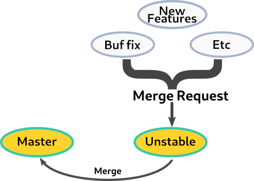

=====================
  How to Contribute
=====================

.. contents::
   :depth: 1
   :local:
   :backlinks: none

.. highlight:: console

Overview
--------
The Linux Kernel and Git community inspired our contribution process. As a
result, this document is directly based on their contribution documentation.
In particular, the text under 'Commit Messages' and 'Certify Your Work by Adding
Your "Signed-off-by: " Line' are directly copied-and-pasted from Git's
SubmittingPatches doc (with some modifications). For the original document,
please check https://git-scm.com/docs/SubmittingPatches/

Development Cycle and Branches
------------------------------
Kw's development happens in GitHub. The official repository can be found at
https://github.com/kworkflow/kworkflow/. Our development cycle relies on two
different branches:

1. **master**: We maintain the kw stable version in the master branch, and we
try our best to keep master working well for final users. If you only want to
use kw, this branch is perfect for you.

2. **ustable**: This branch has the kw latest version, and it is the
development branch. If you want to contribute to kw, base your work in this
branch.

.. warning::
   If you want to contribute to `kw`, use the **unstable** branch and send your
   pull requests to this branch.

From time to time, when we feel happy with the unstable version, we merge the
commit from the unstable version to master. The Figure below summarizes the
development cycle.

.. note::
    One of our main goals is to keep kw stable. In this sense, **if you send a
    new patch do not forget to add tests**. You might also want to fork `kw at
    github <https://github.com/kworkflow/kworkflow/>`_ and allow
    `travis-ci <https://www.travis-ci.com/github/kworkflow/kworkflow/branches>`_
    builds for it, to automatically run the test in the cloud. If you want to
    know more about tests, take a look at `About Tests` page.

Commit Messages
---------------

The first line of the commit message should be a short description (50
characters is the soft limit), and should skip the full stop. It is also
conventional in most cases to prefix the first line with "area: " where the
area is a filename or identifier for the general area of the code being
modified, e.g.

* setup: disable unnecessary download of checkpatch script
* src: mk: remove unnecessary multiplication of PARALLEL_CORES

If in doubt which identifier to use, run `git log --no-merges` on the files you
are modifying to see the current conventions.

It's customary to start the remainder of the first line after "area: " with a
lower-case letter. E.g. "doc: clarify...", not "doc: Clarify...". (But as you
might see in our log, that's a soft rule in kw.)

The body should provide a meaningful commit message, which:

* explains the problem the change tries to solve, i.e. what is wrong
  with the current code without the change.

* justifies the way the change solves the problem, i.e. why the
  result with the change is better.

* alternate solutions considered but discarded, if any.

Describe your changes in imperative mood, e.g. "make xyzzy do frotz" instead of
"[This patch] makes xyzzy do frotz" or "[I] changed xyzzy to do frotz", as if
you are giving orders to the codebase to change its behavior. Try to make sure
your explanation can be understood without external resources. At the bottom of
the message body, you might include references to the issues that the said
commit solves. This can be something like "Solves #30", "Fixes: #28" or
"Closes #10".

Certify Your Work by Adding Your "Signed-off-by: " Line
-------------------------------------------------------

To improve tracking of who did what, we've borrowed the "sign-off" procedure
from the Linux kernel project on patches that are being emailed around.
Although core Git is a lot smaller project it is a good discipline to follow
it.

The sign-off is a simple line at the end of the explanation for the patch,
which certifies that you wrote it or otherwise have the right to pass it on as
an open-source patch.  The rules are pretty simple: if you can certify the
below Developer's Certificate of Origin (D-C-O):

.. important::
    By making a contribution to this project, I certify that:

    1. The contribution was created in whole or in part by me and I have the
    right to submit it under the open source license indicated in the file; or

    2. The contribution is based upon previous work that, to the best of my
    knowledge, is covered under an appropriate open source license and I have
    the right under that license to submit that work with modifications,
    whether created in whole or in part by me, under the same open source
    license (unless I am permitted to submit under a different license), as
    indicated in the file; or

    3. The contribution was provided directly to me by some other person who
    certified (a), (b) or (c) and I have not modified it.

    4. I understand and agree that this project and the contribution are public
    and that a record of the contribution (including all personal information I
    submit with it, including my sign-off) is maintained indefinitely and may
    be redistributed consistent with this project or the open source license(s)
    involved.

then you just add a line saying::

 Signed-off-by: Xpto Lalala Blabla <xpto@developer.example.org>

This line can be automatically added by Git if you run the git-commit
command with the `-s` option.

Notice that you can place your own Signed-off-by: line when forwarding somebody
else's patch with the above rules for D-C-O.  Indeed you are encouraged to do
so.

.. note::
  Also notice that a real name is used in the Signed-off-by: line. Please don't
  hide your real name.

If you like, you can put extra tags at the end:

    1. Reported-by: is used to credit someone who found the bug that the patch
    attempts to fix.

    2. Acked-by: says that the person who is more familiar with the area the
    patch attempts to modify liked the patch.

    3. Reviewed-by:, unlike the other tags, can only be offered by the reviewer
    and means that she is completely satisfied that the patch is ready for
    application. It is usually offered only after a detailed review.

    4. Tested-by: is used to indicate that the person applied the patch and
    found it to have the desired effect.

You can also create your own tag or use one that’s in common usage such as
`Co-authored-by` or `Helped-by`.

About Issue Labels
------------------
We use GitHub's issue and milestone trackers to help managing the kw project.
We use issues for keeping track of different things, as a result, we categorize
all of them with labels; most of the available labels are self-explanatory.
However, few of them deserve a brief explanation:

* **done: wait for stable**: In the section *Development Cycle and Branches* we
  explained how our branch management works. Recall that we have an unstable
  branch that sooner or later will be merged into the master branch (stable).
  This label is used for identifying issues already solved on the unstable, but
  not landed in the master yet. If you see this label, feel free to test the
  feature/bugfix in the unstable branch.
* **new feature request**: If you want to request or see a possible new
  feature, you should use this label.
* **good first issue**: If you started to use kw, and after that, you
  desire to contribute to it but you don't know where you could start, this
  label is the answer to your aspiration.
* **optimization**: Issues that require optimization in kw.
* **help wanted**: We don't know how to solve this or we don't have the time
  right now. Any help solving the issue will be highly appreciated.
* **question**: We map user questions with this label.
* **test**: Issues related to kw's test suite. Any kind of test or even the
  `run_tests` script itself.

How we incorporate PRs
----------------------
In kw project, we avoid the addition of extra commits per PRs. For this reason,
after we accept a contribution, we take it and apply it on top of the unstable
branch. We only add a merge commit when we merge the unstable branch into the
master branch, and usually, this commit has a summary of the new features
brought by the unstable branch.

Releases
--------
We have a simple rule for making a release: It'll be Done when it's done. If
you want to follow our release plans, just take a look at the milestones_ since
we use it for self-organization.

.. _milestones: https://github.com/kworkflow/kworkflow/milestones
