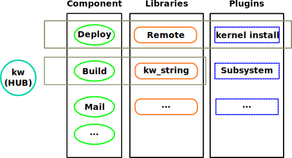

=================
Project Structure
=================

.. _project-structure:

.. contents::
  :depth: 1
  :local:
  :backlinks: none

**Kw** is written in Bash, and it follows multiple rules in order to keep the
source code organized and manageable. Some of these constraints are enforced by
external tools like `shellcheck <https://www.shellcheck.net/>`_ that helps
avoid common Bash mistakes and `shfmt <https://github.com/mvdan/sh>`_ that
enforces code-style patterns. Other rules are described in the :ref:`code-style
<coding-style>` documentation. In this sense, this page describes the overall
code architecture and some details associated with the code.

If you are starting to work with **kw**'s source, you should see it in five
different levels: **hub** (`kw` file), **components**, **libraries**,
**plugins**, and **documentation**. Some of it is shown in the picture below.

Let's dissect this diagram and get a closer look at each section.

Hub (`kw` file)
---------------

**kw** supports multiple features that are not directly related to each other.
For example, the `deploy` component is not directly related to the `config
manager` feature; nonetheless, we still need to provide a unified experience
for the final user. To achieve this goal, **kw** has a file named `kw`, which
works as a Hub to all components provided by **kw**. In other words, all
commands are managed by the `kw` file first, and this file is responsible for
calling the right component. If you want to add a new feature to **kw**, the
`kw` file should be your starting point.

Components
----------

We treat every feature under kw as a specific component, usually with a
dedicated file. For example, the deploy feature implementation can be seen in
the `src/deploy.sh` file and the mail implementation in the `src/mail.sh` file.
Usually, the component file follows this basic structure (see :ref:`code-style
<coding-style>` for more details):

.. code-block:: bash

  # Multi line comment explaining this component.
  # Not necessarily super detailed, but enough to give the reader an idea
  # of what is going on.

  # feature entry point, this is the function called by the 'kw' file
  function <feature_name>_main()
  {
    ...
  }

  ... feature implementation ...

  # this function reads and interprets the arguments
  function parse_<feature_name>_options()
  {
    ...
  }

  # this function prints a small help text or opens the related man page
  function <feature_name>_help()
  {
    ...
  }

This standardized structure makes the components easier to read and understand,
as the top of the file is dedicated to explain the component, and harbors the
entry point function that organizes the component's function. Furthermore, the
options parser and help functions are located at the bottom of the file,
allowing for the middle section to be dedicated to the actual implementation of
the components' functionality. If you understand this organization, you can
easily find your way around the code by reading the code in the main function.

Libraries
---------

As the name suggests, those elements work as a library. These files are shared
and contain useful code used in multiple areas. For example, we have libraries
to help with string manipulation and remote access.

Plugins
-------

Usually, we want to isolate code that can change externally, is very mutable
or too specific in the plugins folder. For example, we have a DRM plugin
specific to the kernel's GPU community.

Documentation
-------------

We have a `documentation` directory dedicated to the project's documentation
files. They are used to generate the man pages -- accessible via the terminal
using ``kw man <feature>`` -- and our `website <https://kworkflow.org/>`_. The
content is mostly kept in `.rst` files and is compiled using the `Sphinx
<https://www.sphinx-doc.org>`_ tool.

Adding a new feature
--------------------

Based on the previous explanation, If you want to add a new feature, you just
need to follow this template:

1. Create a file with the same name as your feature under the `src/` folder.
2. Add your feature name in the `kw` file, and include your new file as part of
   it.
3. Implement ``<your_feature_name>_main()`` function in the file you created in
   step 1.

Fix a bug or improve a feature
------------------------------

Let's say that you found a bug or you want to expand a **kw** feature; you can
find yourself in the code by following this step:

1. In the `kw` file, find the feature name.
2. After identifying the feature name, see which file is included.
3. Take a look at the ``<feature_name>_main()`` to understand the code
   sequence.
